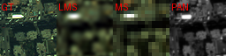

# Papers with Code
<!-- 줄 바꿈은 문장 끝 스페이스바 두번 -->

This page provides an overview of key topics related to Domain Style Alignment along with representative papers. 
It also includes a summary of widely used datasets in the field of Remote Sensing. 
Our own research related to this topic can be found [here](content/README.md).

 <!-- 줄바꿈-->

## Pansharpening(include Hyper-pans)
Additional helpful resources [Repo 1](https://github.com/yuanmaoxun/Working-For-Pansharpening), [Repo 2](https://github.com/yc-cui/Pansharpening-Zoo)

### Suvery
| Venue | Year | Paper | Code | Remarks |
|-------|------|-----|--------|--------|
|  | 2025 | [Advancing Image Super-resolution Techniques in Remote Sensing: A Comprehensive Survey](https://arxiv.org/abs/2505.23248) |  |  |
| GRSM | 2024 | [Hyperspectral Pansharpening: Critical review, tools, and future perspectives](https://ieeexplore.ieee.org/abstract/document/10804644) | [Repo](https://github.com/matciotola/hyperspectral_pansharpening_toolbox) |  |
| ERX | 2024 | [Pansharpening and spatiotemporal image fusion method for remote sensing](https://iopscience.iop.org/article/10.1088/2631-8695/ad3a34/meta) |  |  |

### Only Diffusion
| Venue | Year | AKA | Paper | Code | Remarks |
|-------|------|-----|--------|--------|--------|
| TIM | 2025 | IRR-DiffSR | [Efficient High-Frequency Texture Recovery Diffusion Model for Remote Sensing Image Super-Resolution](https://ieeexplore.ieee.org/abstract/document/10947187) | [Repo](https://github.com/55Dupup/IRR-DiffSR) |  |
| ISPRS JPRS | 2025 | SGDM | [Semantic guided large scale factor remote sensing image super-resolution with generative diffusion prior](https://www.sciencedirect.com/science/article/pii/S0924271624004714) | [Repo](https://github.com/wwangcece/SGDM) |  |
| NeurlPS | 2024 | SSDiff | [SSDiff: Spatial-spectral Integrated Diffusion Model for Remote Sensing Pansharpening](https://proceedings.neurips.cc/paper_files/paper/2024/hash/8e851181b937e2c519ff4c9adbe32be8-Abstract-Conference.html) | [Repo](https://github.com/Z-ypnos/SSDiff_main) |  |
| TIP | 2024 | CrossDiff | [CrossDiff: Exploring Self-Supervised Representation of Pansharpening via Cross-Predictive Diffusion Model](https://ieeexplore.ieee.org/abstract/document/10685062) | [Repo](https://github.com/codgodtao/CrossDiff) |  |
| TGRS | 2024 | HLF-GDiffusion | [High-Low-Frequency Progressive-Guided Diffusion Model for PAN and MS Classification](https://ieeexplore.ieee.org/abstract/document/10589720) | [Repo](https://github.com/Xidian-AIGroup190726/HLF-GDiffusion) |  |
| TGRS | 2024 | FastDiffSR | [A Conditional Diffusion Model With Fast Sampling Strategy for Remote Sensing Image Super-Resolution](https://ieeexplore.ieee.org/abstract/document/10677485) | [Repo](https://github.com/Meng-333/FastDiffSR) |  |
| Information Fusion | 2024 | PLRDiff | [Unsupervised hyperspectral pansharpening via low-rank diffusion model](https://www.sciencedirect.com/science/article/pii/S1566253524001039) | [Repo](https://github.com/earth-insights/PLRDiff) |  |
| Information Fusion | 2024 | Dif-PAN | [Diffusion model with disentangled modulations for sharpening multispectral and hyperspectral images](https://www.sciencedirect.com/science/article/pii/S1566253523004748) | [Repo](https://github.com/294coder/Dif-PAN) |  |
| ISPRS JPRS | 2024 | EVADM | [Effective variance attention-enhanced diffusion model for crop field aerial image super resolution](https://www.sciencedirect.com/science/article/pii/S0924271624003289) | [Repo](https://github.com/HobbitArmy/EVADM) |  |
| TGRS | 2023 | PanDiff | [PanDiff: A Novel Pansharpening Method Based on Denoising Diffusion Probabilistic Model](https://ieeexplore.ieee.org/abstract/document/10136205) |  |  |
| ICCV | 2023 | HSR-Diff | [HSR-Diff: Hyperspectral Image Super-Resolution via Conditional Diffusion Models](https://openaccess.thecvf.com/content/ICCV2023/html/Wu_HSR-Diff_Hyperspectral_Image_Super-Resolution_via_Conditional_Diffusion_Models_ICCV_2023_paper.html) |  |  |
| GRSL | 2023 | LWTDM | [Efficient Remote Sensing Image Super-Resolution via Lightweight Diffusion Models](https://ieeexplore.ieee.org/abstract/document/10325535) | [Repo](https://github.com/Suanmd/LWTDM) |  |
| TGRS | 2023 | EDiffSR | [EDiffSR: An Efficient Diffusion Probabilistic Model for Remote Sensing Image Super-Resolution](https://ieeexplore.ieee.org/abstract/document/10353979) | [Repo](https://github.com/XY-boy/EDiffSR) |  |
|  |  |  |  |  |  |

### Papers with Pretrained
| Venue | Year | AKA | Paper | Code | Remarks |
|-------|------|-----|--------|--------|--------|
| AAAI | 2025 | MFFA | [Wavelet-Assisted Multi-Frequency Attention Network for Pansharpening](https://ojs.aaai.org/index.php/AAAI/article/view/32381) | [Repo](https://github.com/Jie-1203/WFANet) |  |
| CVPR | 2025 | ADWM | [A General Adaptive Dual-level Weighting Mechanism for Remote Sensing Pansharpening](https://arxiv.org/abs/2503.13214) | [Repo](https://github.com/Jie-1203/ADWM) |  |
| CVPR | 2025 | ARConv | [Adaptive Rectangular Convolution for Remote Sensing Pansharpening](https://arxiv.org/abs/2503.00467) | [Repo](https://github.com/WangXueyang-uestc/ARConv) |  |
| CVPR | 2024 | CANConv | [Content-Adaptive Non-Local Convolution for Remote Sensing Pansharpening](https://arxiv.org/abs/2404.07543) | [Repo](https://github.com/duanyll/CANConv) |  |
| AAAI | 2024 | DISPNet | [Deep Unfolded Network with Intrinsic Supervision for Pan-Sharpening](https://ojs.aaai.org/index.php/AAAI/article/view/28350) | [Repo](https://github.com/Baixuzx7/DISPNet) |  |
| TGRS | 2024 | UCGAN | [Unsupervised Pansharpening Based on Double-Cycle Consistency](https://ieeexplore.ieee.org/abstract/document/10457556) | [Repo](https://github.com/zhysora/UCGAN) |  |
| IJCB | 2024 | DCINN | [A General Paradigm with Detail-Preserving Conditional Invertible Network for Image Fusion](https://link.springer.com/article/10.1007/s11263-023-01924-5) | [Repo](https://github.com/wwhappylife/DCINN) |  |
| TGRS | 2024 | DCPNet | [DCPNet: A Dual-Task Collaborative Promotion Network for Pansharpening](https://ieeexplore.ieee.org/abstract/document/10473165) | [Repo](https://github.com/lhf12278/DCPNet) |  |
| TGRS | 2024 | UTeRM | [Deep Unfolding Tensor Rank Minimization With Generalized Detail Injection for Pansharpening](https://ieeexplore.ieee.org/document/10506713) | [Repo](https://github.com/mtntruong/UTeRM) |  |
| ACM MM | 2023 | U2Net | [U2Net: A General Framework with Spatial-Spectral-Integrated Double U-Net for Image Fusion](https://dl.acm.org/doi/abs/10.1145/3581783.3612084) | [Repo](https://github.com/PSRben/U2Net) |  |
| CVPR | 2022 | HyperTransformer | [HyperTransformer: A Textural and Spectral Feature Fusion Transformer for Pansharpening](https://openaccess.thecvf.com/content/CVPR2022/html/Bandara_HyperTransformer_A_Textural_and_Spectral_Feature_Fusion_Transformer_for_Pansharpening_CVPR_2022_paper.html) | [Repo](https://github.com/wgcban/HyperTransformer) |  |
| AAAI | 2022 | LAGConv | [LAGConv: Local-Context Adaptive Convolution Kernels with Global Harmonic Bias for Pansharpening](https://ojs.aaai.org/index.php/AAAI/article/view/19996) |  | Comparison |
| TGRS | 2020 | FusionNet | [Detail Injection-Based Deep Convolutional Neural Networks for Pansharpening](https://ieeexplore.ieee.org/abstract/document/9240949) |  | Comparison |
| JSTARS | 2019 | DiCNN | [Pansharpening via Detail Injection Based Convolutional Neural Networks](https://ieeexplore.ieee.org/abstract/document/8667040) |  | Comparison |
| JSTARS | 2018 | MSDCNN | [A Multiscale and Multidepth Convolutional Neural Network for Remote Sensing Imagery Pan-Sharpening](https://ieeexplore.ieee.org/document/8281501) |  | Comparison |
| ICCV | 2017 | PanNet | [Pannet: A deep network architecture for pan-sharpening](https://openaccess.thecvf.com/content_iccv_2017/html/Yang_PanNet_A_Deep_ICCV_2017_paper.html) |  | Comparison |
| Remote Sensing | 2016 | PNN | [Pansharpening by Convolutional Neural Networks](https://www.mdpi.com/2072-4292/8/7/594) |  | Comparison |
|  |  |  |  |  |  |

Some methods are available at the following locations, [Repo 1](https://github.com/codegaj/py_pansharpening), [Repo 2](https://github.com/matciotola/hyperspectral_pansharpening_toolbox/blob/main/preambol.yaml), [Repo 3](https://github.com/liangjiandeng/DLPan-Toolbox/tree/main/01-DL-toolbox(Pytorch)), [Repo 4](https://github.com/XavierJiezou/Pansharpening)

## Remote Sensing I2I
| Venue | Year | AKA | Paper | Code | Remarks |
|-------|------|-----|--------|--------|--------|
| Remote Sensing | 2025 | RSDiffSR | [Taming a Diffusion Model to Revitalize Remote Sensing Image Super-Resolution](https://www.mdpi.com/2072-4292/17/8/1348#:~:text=conditional%20diffusion%20model%20incorporating%20low,is%20known%20for%20its%20robust) |  | Super-Resolution |
| TGRS | 2024 | Crs-diff | [CRS-Diff: Controllable Remote Sensing Image Generation With Diffusion Model](https://ieeexplore.ieee.org/abstract/document/10663449) | [Repo](https://github.com/Sonettoo/CRS-Diff) | Multi-condition Gen |
|  | 2024 |  | [Accelerating Diffusion for SAR-to-Optical Image Translation via Adversarial Consistency Distillation](https://arxiv.org/abs/2407.06095) | [Repo](https://github.com/Coordi777/ACD_S2ODPM) | SAR -> Optical |
|  |  |  |  |  |  |

## Remote Sensing Image Registration(Geometric Alignment)
| Venue | Year | AKA | Paper | Code | Remarks |
|-------|------|-----|--------|--------|--------|
| TGRS | 2024 | ADRNet | [ADRNet: Affine and Deformable Registration Networks for Multimodal Remote Sensing Images](https://ieeexplore.ieee.org/abstract/document/10459210) | [Repo](https://github.com/Ahuer-Lei/ADRNet) |  |
| TGRS | 2022 | MU-Net | [A Multiscale Framework With Unsupervised Learning for Remote Sensing Image Registration](https://ieeexplore.ieee.org/abstract/document/9758703) | [Repo](https://github.com/yeyuanxin110/MU-Net) |  |
| ISPRS | 2021 |  | [A deep learning semantic template matching framework for remote sensing image registration](https://www.sciencedirect.com/science/article/pii/S0924271621002446?ref=pdf_download&fr=RR-2&rr=949418dc9bb3d1e1) | [Repo](https://github.com/liliangzhi110/semantictemplatematching) |  |
| CVPR | 2021 | LoFTR | [LoFTR: Detector-Free Local Feature Matching with Transformers](https://arxiv.org/abs/2104.00680) | [Repo](https://github.com/zju3dv/LoFTR) |  |
| CVPR | 2020 | SuperGlue | [SuperGlue: Learning Feature Matching with Graph Neural Networks](https://arxiv.org/abs/1911.11763) | [Repo](https://github.com/magicleap/SuperGluePretrainedNetwork) |  |
|  |  |  |  |  |  |

## Diffusion Fine-tunning Methods
| Venue | Year | AKA | Paper | Code | Remarks |
|-------|------|-----|--------|--------|--------|
| AAAI | 2024 | T2i-adapter | [T2I-Adapter: Learning Adapters to Dig Out More Controllable Ability for Text-to-Image Diffusion Models](https://ojs.aaai.org/index.php/AAAI/article/view/28226) | [Repo](https://github.com/TencentARC/T2I-Adapter) |  |
| CVPR | 2023 | Dreambooth | [DreamBooth: Fine Tuning Text-to-Image Diffusion Models for Subject-Driven Generation](https://openaccess.thecvf.com/content/CVPR2023/html/Ruiz_DreamBooth_Fine_Tuning_Text-to-Image_Diffusion_Models_for_Subject-Driven_Generation_CVPR_2023_paper.html) | [Repo](https://github.com/google/dreambooth) |  |
| CVPR | 2023 |  | [Null-text Inversion for Editing Real Images using Guided Diffusion Models](https://openaccess.thecvf.com/content/CVPR2023/html/Mokady_NULL-Text_Inversion_for_Editing_Real_Images_Using_Guided_Diffusion_Models_CVPR_2023_paper.html) | [Repo](https://github.com/google/prompt-to-prompt) |  |
| ICCV | 2023 | ControlNet | [Adding Conditional Control to Text-to-Image Diffusion Models](https://openaccess.thecvf.com/content/ICCV2023/html/Zhang_Adding_Conditional_Control_to_Text-to-Image_Diffusion_Models_ICCV_2023_paper.html) | [Repo](https://github.com/faverogian/controlNet) |  |
| ICLR | 2022 | LoRA | [LoRA: Low-Rank Adaptation of Large Language Models](https://arxiv.org/pdf/2106.09685v1/1000) | [Repo](https://github.com/microsoft/LoRA) |  |
|  | 2022 |  | [Prompt-to-Prompt Image Editing with Cross Attention Control](https://arxiv.org/abs/2208.01626) | [Repo](https://github.com/google/prompt-to-prompt) | Google |
|  |  |  |  |  |  |

## Dataset
Many research papers utilize Gaofen-2(GF2), QuickBird(QB), and WorldView-3(WV3) in their studies  
You can download a sample [PanCollection](https://github.com/liangjiandeng/PanCollection) or [PanBench](https://github.com/XavierJiezou/Pansharpening)

### Example visualization of the WV3 dataset(PanCollection)
GT : shape(9714, 8, 64, 64), min(0.0000), max(2047.0000)  
LMS : shape(9714, 8, 64, 64), min(-222.5743), max(2323.9167)  
MS : shape(9714, 8, 16, 16), min(25.4855), max(1997.7802)  
PAN :shape(9714, 1, 64, 64), min(76.4237), max(1988.2261)  

  

  

  

  

  

  

### Sample of the WV3 train dataset (PanBench)
PAN : 567 x 1 x 1024 x 1024  
NIR : 567 x 1 x 256 x 256  
RGB : 567 x 3 x 256 x 256  

  

 

