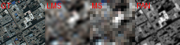

# Overview
This page outlines the research procedure and the required [TGRS template](https://ko.overleaf.com/5911322733rbvbvbcxsnwb#5cca8a)  
The relevant research papers are available on [previous](../README.md) page

## Key challenge
* 8bit 흑백 항공정사영상과 11bit 초소형 전정색 영상 간의 도메인 차이와 미세 기하학적 오차를 보정
    * 분광 특성과 기하 오차를 보완하기 위해, Domain Style Prompt로 전정색 영상의 특성을 반영하고 Mapping Network를 통해 공간 정렬을 수행
* 항공정사영상의 기하 정확도를 유지하면서도 전정색 영상의 도메인 특성을 반영한 '기준데이터'를 생성
    * 항공 영상의 좌표계를 유지한 채, 초소형 전정색 영상의 도메인 특성이 자연스럽게 반영된 기준데이터 생성
* 생성된 기준데이터의 유효성을 자기지도 학습 기반 정합 네트워크로 정량 검증
    * 대응되는 패치 쌍을 추출하고, Binary pseudo-label(정합 여부)과 Bias pseudo-label(중심점 위치 오프셋)을 생성

### Background
#### Dataset
Many research papers utilize Gaofen-2(GF2), QuickBird(QB), and WorldView-3(WV3) in their studies  
You can download a sample [PanCollection](https://github.com/liangjiandeng/PanCollection) or [PanBench](https://github.com/XavierJiezou/Pansharpening)

#### Example visualization of the WV3 train dataset(PanCollection)
GT : shape(9714, 8, 64, 64), min(0.0000), max(2047.0000)  
LMS : shape(9714, 8, 64, 64), min(-222.5743), max(2323.9167)  
MS : shape(9714, 8, 16, 16), min(25.4855), max(1997.7802)  
PAN :shape(9714, 1, 64, 64), min(76.4237), max(1988.2261)  

  

  

  

  

  

  

#### Example visualization of the WV3 train dataset(PanBench)
PAN : 567 x 1 x 1024 x 1024  
NIR : 567 x 1 x 256 x 256  
RGB : 567 x 3 x 256 x 256  

  

 

#### Expected Architecture

  

 
